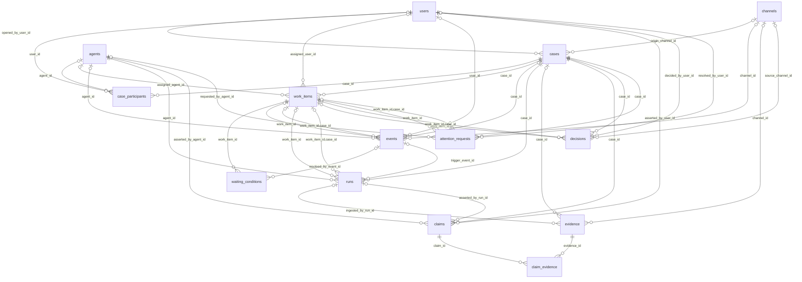
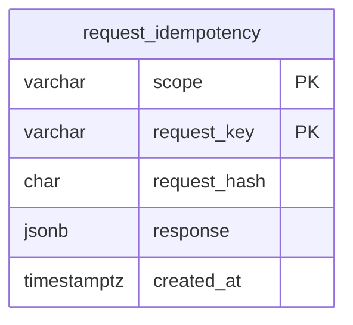

# MULINO COREANO — ERD

> 본 문서는 `database/ddl/`의 PostgreSQL 스키마를 기준으로 작성된 엔터프라이즈 ERD입니다.  
> 기존 ERP·거버넌스·품질·규제 모델 **30개 테이블, 46개 외래키 관계**에 인터페이스 운영 모델 **13개 테이블**을 추가한 스키마입니다. 기존 모델은 §1~5, Case·이벤트·컨텍스트 모델은 §6에서 설명합니다.
> 스키마 변경 시 이 문서와 `docs/02_flow.md`를 함께 갱신해야 합니다.

---

## 1. 전체 ERD

아래 다이어그램은 기존 ERP 모델의 **30개 테이블**, **46개 외래키 관계**를 포함합니다. 추가된 인터페이스 관계는 §6의 별도 다이어그램에 있습니다.

```mermaid
erDiagram
    users {
        int user_id PK "NOT NULL"
        varchar name "NOT NULL"
        varchar email UK "NOT NULL / UNIQUE"
        varchar password "NOT NULL"
        user_role role "NOT NULL"
        boolean is_active "NOT NULL / DEFAULT TRUE"
        timestamp updated_at "NOT NULL / DEFAULT CURRENT_TIMESTAMP"
        timestamp created_at "NOT NULL / DEFAULT CURRENT_TIMESTAMP"
    }

    suppliers {
        int supplier_id PK "NOT NULL"
        varchar name "NOT NULL"
        varchar country "NOT NULL"
        varchar contact_name "nullable"
        varchar contact_email "nullable"
        varchar contact_phone "nullable"
        timestamp created_at "NOT NULL / DEFAULT CURRENT_TIMESTAMP"
        boolean is_active "NOT NULL / DEFAULT TRUE"
    }

    products {
        int product_id PK "NOT NULL"
        varchar name "NOT NULL"
        varchar sku UK "NOT NULL / UNIQUE"
        varchar unit "NOT NULL"
        int expiry_days "NOT NULL"
        product_type product_type "NOT NULL / DEFAULT FINISHED_GOODS"
        varchar registration_number "nullable / 식약처 품목제조보고번호"
        varchar trace_code "nullable / 식약처 식품이력추적관리 등록번호"
        varchar country_of_origin "nullable"
        jsonb attributes "nullable / 비건, Non-GMO 등 확장 메타데이터"
        boolean is_active "NOT NULL / DEFAULT TRUE"
        timestamp created_at "NOT NULL / DEFAULT CURRENT_TIMESTAMP"
    }

    raw_materials {
        int raw_material_id PK "NOT NULL"
        varchar name "NOT NULL"
        varchar unit "NOT NULL"
        material_type material_type "NOT NULL / DEFAULT INGREDIENT"
        int supplier_id FK "NOT NULL"
        jsonb attributes "nullable / 규격, 보관조건 등 확장 메타데이터"
        timestamp created_at "NOT NULL / DEFAULT CURRENT_TIMESTAMP"
    }

    customers {
        int customer_id PK "NOT NULL"
        varchar name "NOT NULL"
        varchar contact_name "nullable"
        varchar contact_email "nullable"
        varchar contact_phone "nullable"
        varchar address "nullable"
        timestamp created_at "NOT NULL / DEFAULT CURRENT_TIMESTAMP"
    }

    allergens {
        int allergen_id PK "NOT NULL"
        varchar name "NOT NULL"
        varchar code "nullable / 알레르겐 코드"
        varchar legal_category "NOT NULL / 19개 법정 표시의무 군"
        varchar standard "NOT NULL / DEFAULT KR_MFDS"
    }

    warehouses {
        int warehouse_id PK "NOT NULL"
        varchar name "NOT NULL"
        varchar location "nullable"
        warehouse_type type "NOT NULL"
        varchar plant_id "nullable / 공장 및 사업장 식별자"
        int parent_warehouse_id FK "nullable / 구역 및 Zone 계층"
        timestamp created_at "NOT NULL / DEFAULT CURRENT_TIMESTAMP"
    }

    raw_material_allergens {
        int raw_material_allergen_id PK "NOT NULL"
        int raw_material_id FK "NOT NULL"
        int allergen_id FK "NOT NULL"
        boolean is_trace "NOT NULL / DEFAULT FALSE"
    }

    supplier_certifications {
        int supplier_certification_id PK "NOT NULL"
        int supplier_id FK "NOT NULL"
        supplier_certification_cert_type cert_type "NOT NULL"
        varchar cert_number "NOT NULL"
        varchar issued_by "NOT NULL"
        date issue_date "NOT NULL"
        date expiry_date "NOT NULL"
        varchar file_url "nullable"
        timestamp created_at "NOT NULL / DEFAULT CURRENT_TIMESTAMP"
    }

    purchase_orders {
        int purchase_order_id PK "NOT NULL"
        int supplier_id FK "NOT NULL"
        int created_by FK "NOT NULL"
        date order_date "NOT NULL"
        date expected_delivery_date "nullable"
        purchase_order_status status "NOT NULL / DEFAULT DRAFT"
        timestamp created_at "NOT NULL / DEFAULT CURRENT_TIMESTAMP"
        varchar tax_invoice_number "nullable"
        date tax_invoice_date "nullable"
    }

    purchase_order_items {
        int purchase_order_item_id PK "NOT NULL"
        int purchase_order_id FK "NOT NULL"
        int raw_material_id FK "NOT NULL"
        int quantity "NOT NULL"
        decimal unit_price "NOT NULL / KRW 단가 (15,2)"
        int received_quantity "NOT NULL / DEFAULT 0"
    }

    inbound {
        int inbound_id PK "NOT NULL"
        int raw_material_id FK "NOT NULL"
        int supplier_id FK "NOT NULL"
        int warehouse_id FK "NOT NULL"
        int purchase_order_item_id FK "NOT NULL"
        int quantity "NOT NULL"
        date inbound_date "NOT NULL"
        date expiry_date "nullable"
        inbound_status status "NOT NULL / DEFAULT HOLD"
        text status_reason "nullable"
        int status_decided_by FK "nullable"
        timestamp status_decided_at "nullable"
        timestamp created_at "NOT NULL / DEFAULT CURRENT_TIMESTAMP"
    }

    inbound_temperature_logs {
        int inbound_temperature_id PK "NOT NULL"
        int inbound_id FK "NOT NULL"
        decimal temperature "NOT NULL"
        varchar sensor_id "nullable"
        timestamp recorded_at "NOT NULL / DEFAULT CURRENT_TIMESTAMP"
        varchar location_note "nullable"
    }

    raw_material_lots {
        int raw_material_lot_id PK "NOT NULL"
        int raw_material_id FK "NOT NULL"
        int inbound_id FK "NOT NULL"
        varchar supplier_lot_number "nullable"
        varchar lot_number UK "NOT NULL / UNIQUE"
        int quantity "NOT NULL"
        int remaining_quantity "NOT NULL"
        date production_date "nullable"
        date expiry_date "nullable"
        timestamp created_at "NOT NULL / DEFAULT CURRENT_TIMESTAMP"
    }

    warehouse_temperature_logs {
        int warehouse_temperature_id PK "NOT NULL"
        int warehouse_id FK "NOT NULL"
        decimal temperature "NOT NULL"
        varchar sensor_id "nullable"
        decimal humidity "nullable"
        timestamp recorded_at "NOT NULL / DEFAULT CURRENT_TIMESTAMP"
    }

    production_lots {
        int production_lot_id PK "NOT NULL"
        int product_id FK "NOT NULL"
        varchar lot_number UK "NOT NULL / UNIQUE"
        date production_date "NOT NULL"
        date expiry_date "NOT NULL"
        int quantity "NOT NULL"
        production_lot_status status "NOT NULL / DEFAULT ACTIVE"
        timestamp created_at "NOT NULL / DEFAULT CURRENT_TIMESTAMP"
    }

    production_records {
        int production_record_id PK "NOT NULL"
        int lot_id FK "NOT NULL"
        int warehouse_id FK "NOT NULL"
        int operator_id FK "NOT NULL"
        production_record_process_type process_type "NOT NULL"
        timestamp start_time "NOT NULL"
        timestamp end_time "nullable"
        decimal temperature "nullable"
        jsonb parameters "nullable / 공정 파라미터 메타데이터"
        text note "nullable"
        timestamp created_at "NOT NULL / DEFAULT CURRENT_TIMESTAMP"
    }

    production_ingredients {
        int production_ingredient_id PK "NOT NULL"
        int production_record_id FK "NOT NULL"
        int raw_material_lot_id FK "NOT NULL"
        int quantity_used "NOT NULL"
    }

    stock {
        int stock_id PK "NOT NULL"
        int product_id FK "NOT NULL"
        int warehouse_id FK "NOT NULL"
        int quantity "NOT NULL"
        timestamp updated_at "NOT NULL / DEFAULT CURRENT_TIMESTAMP"
    }

    orders {
        int order_id PK "NOT NULL"
        int customer_id FK "NOT NULL"
        int created_by FK "NOT NULL"
        date order_date "NOT NULL"
        date expected_delivery_date "nullable"
        timestamp created_at "NOT NULL / DEFAULT CURRENT_TIMESTAMP"
        order_status status "NOT NULL / DEFAULT PENDING"
        varchar tax_invoice_number "nullable"
        date tax_invoice_date "nullable"
    }

    order_items {
        int orders_item_id PK "NOT NULL"
        int order_id FK "NOT NULL"
        int product_id FK "NOT NULL"
        int quantity "NOT NULL"
        decimal unit_price "NOT NULL / KRW 단가 (15,2)"
    }

    outbound {
        int outbound_id PK "NOT NULL"
        int product_id FK "NOT NULL"
        int warehouse_id FK "NOT NULL"
        int order_id FK "NOT NULL"
        int quantity "NOT NULL"
        date outbound_date "NOT NULL"
        timestamp created_at "NOT NULL / DEFAULT CURRENT_TIMESTAMP"
    }

    outbound_lots {
        int outbound_lot_id PK "NOT NULL"
        int outbound_id FK "NOT NULL"
        int lot_quantity "NOT NULL"
        int lot_id FK "NOT NULL"
    }

    recalls {
        int recall_id PK "NOT NULL"
        int lot_id FK "nullable"
        int raw_lot_id FK "nullable"
        date recall_date "NOT NULL"
        text reason "nullable"
        recall_status status "NOT NULL / DEFAULT OPEN"
        timestamp created_at "NOT NULL / DEFAULT CURRENT_TIMESTAMP"
    }

    governance_actions {
        bigint governance_action_id PK "NOT NULL"
        int requested_by FK "NOT NULL"
        varchar action_type "NOT NULL"
        varchar resource_type "NOT NULL"
        int resource_id "NOT NULL"
        jsonb payload "NOT NULL"
        int current_step "NOT NULL / DEFAULT 1"
        int total_steps "NOT NULL / DEFAULT 1"
        user_role required_role "NOT NULL"
        varchar priority "NOT NULL / DEFAULT NORMAL"
        governance_action_status status "NOT NULL / DEFAULT PENDING"
        timestamp requested_at "NOT NULL / DEFAULT CURRENT_TIMESTAMP"
        timestamp expires_at "nullable"
    }

    governance_decisions {
        bigint governance_decision_id PK "NOT NULL"
        bigint governance_action_id FK "NOT NULL"
        int decided_by FK "NOT NULL"
        governance_decision_type decision "NOT NULL"
        text reason "NOT NULL"
        timestamp decided_at "NOT NULL / DEFAULT CURRENT_TIMESTAMP"
    }

    governance_audit_logs {
        bigint governance_audit_log_id PK "NOT NULL"
        bigint governance_action_id FK "nullable"
        int actor_id FK "nullable"
        varchar event_type "NOT NULL"
        varchar resource_type "NOT NULL"
        int resource_id "NOT NULL"
        jsonb before_state "nullable"
        jsonb after_state "nullable"
        timestamp occurred_at "NOT NULL / DEFAULT CURRENT_TIMESTAMP"
    }

    alert_rules {
        int alert_rule_id PK "NOT NULL"
        varchar resource_type "NOT NULL"
        varchar rule_name "NOT NULL"
        alert_severity severity "NOT NULL / DEFAULT WARNING"
        jsonb threshold "NOT NULL"
        boolean is_active "NOT NULL / DEFAULT TRUE"
        timestamp effective_from "NOT NULL / DEFAULT CURRENT_TIMESTAMP"
        timestamp effective_to "nullable"
    }

    alert_events {
        bigint alert_event_id PK "NOT NULL"
        int alert_rule_id FK "nullable"
        int inbound_id FK "nullable"
        int warehouse_id FK "nullable"
        varchar sensor_id "nullable"
        varchar alert_type "NOT NULL"
        alert_severity severity "NOT NULL / DEFAULT WARNING"
        jsonb observed_value "NOT NULL"
        timestamp detected_at "NOT NULL / DEFAULT CURRENT_TIMESTAMP"
        timestamp resolved_at "nullable"
    }

    regulatory_submissions {
        bigint regulatory_submission_id PK "NOT NULL"
        regulatory_submission_type submission_type "NOT NULL"
        int recall_id FK "nullable"
        varchar authority "NOT NULL / DEFAULT MFDS"
        timestamp submitted_at "nullable"
        varchar confirmation_number "nullable"
        regulatory_submission_result result "NOT NULL / DEFAULT PENDING"
        timestamp due_at "NOT NULL"
        varchar evidence_url "nullable"
        jsonb metadata "nullable"
    }

    %% Master Relations
    suppliers ||--o{ raw_materials : "공급하는"
    suppliers ||--o{ supplier_certifications : "보유한"
    raw_materials ||--o{ raw_material_allergens : "매핑된"
    allergens ||--o{ raw_material_allergens : "매핑되는"
    warehouses |o--o{ warehouses : "상위구역"

    %% Purchasing & Inbound Chain
    suppliers ||--o{ purchase_orders : "수주하는"
    users ||--o{ purchase_orders : "생성한"
    purchase_orders ||--o{ purchase_order_items : "포함하는"
    raw_materials ||--o{ purchase_order_items : "발주된"
    raw_materials ||--o{ inbound : "입고되는"
    suppliers ||--o{ inbound : "납품하는"
    warehouses ||--o{ inbound : "보관되는"
    purchase_order_items ||--o{ inbound : "실물 수령된"
    users |o--o{ inbound : "품질결정한"
    inbound ||--o{ inbound_temperature_logs : "기록된"
    raw_materials ||--o{ raw_material_lots : "생성된"
    inbound ||--o{ raw_material_lots : "생성된"

    %% Warehousing & Production Chain
    warehouses ||--o{ warehouse_temperature_logs : "기록된"
    products ||--o{ stock : "보관된"
    warehouses ||--o{ stock : "보관된"
    products ||--o{ production_lots : "생산된"
    production_lots ||--o{ production_records : "대상인"
    warehouses ||--o{ production_records : "수행된"
    users ||--o{ production_records : "작업한"
    production_records ||--o{ production_ingredients : "투입된"
    raw_material_lots ||--o{ production_ingredients : "투입되는"

    %% Order & Outbound Chain
    customers ||--o{ orders : "주문한"
    users ||--o{ orders : "생성한"
    orders ||--o{ order_items : "포함하는"
    products ||--o{ order_items : "주문된"
    products ||--o{ outbound : "출고되는"
    warehouses ||--o{ outbound : "출고되는"
    orders ||--o{ outbound : "이행되는"
    outbound ||--o{ outbound_lots : "할당된"
    production_lots ||--o{ outbound_lots : "할당되는"

    %% Quality Recalls & Incidents
    production_lots |o--o{ recalls : "리콜 대상"
    raw_material_lots |o--o{ recalls : "리콜 대상"

    %% L1 Governance Persistence
    users ||--o{ governance_actions : "요청한"
    governance_actions ||--o{ governance_decisions : "결정된"
    users ||--o{ governance_decisions : "결정한"
    governance_actions |o--o{ governance_audit_logs : "감사된"
    users |o--o{ governance_audit_logs : "수행한"

    %% Quality Alert Engine
    alert_rules |o--o{ alert_events : "평가된"
    inbound |o--o{ alert_events : "입고이상"
    warehouses |o--o{ alert_events : "창고이상"

    %% Regulatory Compliance
    recalls |o--o{ regulatory_submissions : "보고된"
```



---

## 2. 양방향 추적 체인 (Traceability Invariants)

```text
순추적 (Forward Tracing)
suppliers
  -> purchase_orders
  -> purchase_order_items
  -> inbound
  -> raw_material_lots
  -> production_ingredients
  -> production_records
  -> production_lots
  -> outbound_lots
  -> outbound
  -> orders
  -> customers

역추적 (Backward Tracing)
customers
  -> orders
  -> outbound
  -> outbound_lots
  -> production_lots
  -> production_records
  -> production_ingredients
  -> raw_material_lots
  -> inbound
  -> purchase_order_items
  -> purchase_orders
  -> suppliers
```

### 핵심 데이터 불변식 (Core Invariants)
1. `SUM(outbound_lots.lot_quantity) = outbound.quantity` (출고 수량 정합성)
2. 생산 투입 시 `raw_material_lots.remaining_quantity` 차감 및 `0 <= remaining_quantity <= quantity` 보장
3. 입고 기본 상태는 `HOLD`이며, `RELEASED`/`BLOCKED` 전환 시 결정자(`status_decided_by`) 및 사유(`status_reason`) 필수 기록
4. 리콜 발생 시 `recalls`에 `lot_id` 또는 `raw_lot_id` 중 최소 1개 이상 필수 지정 (`ck_recalls_target`)
5. 식품이력추적관리법상 `소비기한 + 2년` 동안 추적 체인의 물리 삭제 금지 (소프트 삭제 `is_active` 사용)

---

## 3. ENUM 타입 참조 (16종)

| ENUM 타입 | 값 목록 | 사용 컬럼 |
|---|---|---|
| `user_role` | `ADMIN`, `MANAGER`, `OPERATOR`, `QC`, `VIEWER` | `users.role`, `governance_actions.required_role` |
| `material_type` | `INGREDIENT`, `PACKAGING`, `ADDITIVE`, `CONSUMABLE` | `raw_materials.material_type` |
| `product_type` | `FINISHED_GOODS`, `SEMI_FINISHED`, `INTERMEDIATE` | `products.product_type` |
| `supplier_certification_cert_type` | `HACCP`, `ISO22000`, `FSSC22000`, `GMP`, `ORGANIC`, `HALAL`, `KOSHER`, `TRACEABILITY` | `supplier_certifications.cert_type` |
| `purchase_order_status` | `DRAFT`, `ORDERED`, `PARTIAL`, `COMPLETED` | `purchase_orders.status` |
| `inbound_status` | `HOLD`, `RELEASED`, `BLOCKED` | `inbound.status` |
| `production_record_process_type` | `MIX`, `HEAT`, `COOL`, `PACK` | `production_records.process_type` |
| `production_lot_status` | `ACTIVE`, `QUARANTINE`, `RECALLED`, `CONSUMED` | `production_lots.status` |
| `order_status` | `PENDING`, `CONFIRMED`, `SHIPPED`, `CANCELLED` | `orders.status` |
| `recall_status` | `OPEN`, `IN_PROGRESS`, `RESOLVED`, `CLOSED` | `recalls.status` |
| `warehouse_type` | `AMBIENT`, `CHILLED`, `FROZEN` | `warehouses.type` |
| `governance_action_status` | `PENDING`, `APPROVED`, `BLOCKED`, `EXPIRED` | `governance_actions.status` |
| `governance_decision_type` | `APPROVE`, `BLOCK`, `CANCEL` | `governance_decisions.decision` |
| `regulatory_submission_type` | `RECALL_REPORT`, `TRACEABILITY_TRANSMISSION` | `regulatory_submissions.submission_type` |
| `regulatory_submission_result` | `PENDING`, `ACCEPTED`, `REJECTED` | `regulatory_submissions.result` |
| `alert_severity` | `INFO`, `WARNING`, `CRITICAL` | `alert_rules.severity`, `alert_events.severity` |

---

## 4. DDL 소스 및 테이블 매핑

| 분류 | 테이블명 | 설명 | 정의 파일 |
|---|---|---|---|
| **마스터 (7)** | `users`, `suppliers`, `products`, `raw_materials`, `customers`, `allergens`, `warehouses` | 기본 기준정보 (자재/제품유형, 19개 법정알레르겐, 플랜트 포함) | `database/ddl/01_master_tables.sql` |
| **관계 (2)** | `raw_material_allergens`, `supplier_certifications` | 다대다 매핑 및 공급업체 인증 관리 (복합 UNIQUE, 날짜 CHECK) | `database/ddl/02_relation_tables.sql` |
| **트랜잭션 (15)** | `purchase_orders`, `purchase_order_items`, `inbound`, `inbound_temperature_logs`, `raw_material_lots`, `warehouse_temperature_logs`, `production_lots`, `production_records`, `production_ingredients`, `stock`, `orders`, `order_items`, `outbound`, `outbound_lots`, `recalls` | 구매-입고-생산-재고-출고-리콜 전 프로세스 트랜잭션 | `database/ddl/03_transaction_tables.sql` |
| **거버넌스 (3)** | `governance_actions`, `governance_decisions`, `governance_audit_logs` | L1 액션 인터셉트, 다단계 승인 의사결정 및 불변 감사 로그 | `database/ddl/03_transaction_tables.sql` |
| **품질/알람 (2)** | `alert_rules`, `alert_events` | 동적 품질/온도 임계치 규칙 및 IoT 센서 알람 이벤트 | `database/ddl/03_transaction_tables.sql` |
| **규제/컴플라이언스 (1)** | `regulatory_submissions` | 식약처 리콜 즉시보고 및 5일 이력정보 전송 증빙 관리 | `database/ddl/03_transaction_tables.sql` |
| **뷰 (1)** | `v_retention_deadlines` | 식품이력추적관리법(소비기한+2년) 의무 보관 만료일 산출 뷰 | `database/ddl/05_foreign_keys.sql` |

---

## 5. 법적 의무 보관 기한 산출 뷰 (`v_retention_deadlines`)

식품 등의 이력추적관리기준(식약처 고시)에 따라 완제품 및 원자재 LOT의 소비기한 경과 후 최소 2년간 전자 기록을 보존해야 합니다.

```sql
SELECT 
    entity_type,
    entity_id,
    lot_number,
    consumption_expiry_date,
    retention_due_date,
    retention_status
FROM v_retention_deadlines
WHERE retention_status = 'ACTIVE_HOLD_REQUIRED';
```


---

## 6. 인터페이스 운영 ERD (추가 13개 테이블)

`database/ddl/07_case_management.sql`의 운영 상태는 기존 ERP 행을 복제하지 않는다. `08_case_indexes.sql`과 `09_case_fks.sql`이 인덱스·FK를 연결하며, 백엔드에서는 Flyway 마이그레이션으로 같은 제약을 적용한다.

| 테이블 | 역할·핵심 연결 |
|---|---|
| `channels` | CHAT/SLACK/EMAIL/DASHBOARD/API 유입 표면과 외부 참조 |
| `agents` | Run과 독립된 논리 에이전트 정체성·활성 여부 |
| `cases` | 목표·상태·원본 채널·생성 사용자 |
| `case_participants` | Case의 참여 에이전트 또는 사용자와 역할 |
| `work_items` | Case의 구체적 의무·담당·기한·ERP `businessRef` |
| `waiting_conditions` | 의무의 대기 조건·해소 상태·원인 Event |
| `events` | 외부 입력·재판정의 불변 사실·멱등 키·actor |
| `runs` | 담당 에이전트의 실행 예약·trigger Event·컨텍스트 감사 스냅샷 |
| `evidence` | 증거 참조·출처·관측 시각·원문 위치·해시 |
| `claims` | Case의 주장·상태·주장 주체와 Run |
| `claim_evidence` | 주장과 증거의 SUPPORTS/REFUTES 관계 |
| `decisions` | 인간 결정·적용 범위·Case/Work Item·채널 |
| `attention_requests` | 인간이 필요한 이유·질문·결과·답변 범위 |



### 인터페이스 불변식

- Work Item 담당은 에이전트와 사용자 중 최대 한 명이다. Case 참여자는 같은 actor를 중복 등록하지 않는다.
- Event, Run, Decision, Attention의 Work Item 참조는 해당 Case 소속이어야 한다. 복합 FK가 `(work_item_id, case_id)`를 검증한다.
- Event는 UPDATE/DELETE/TRUNCATE 불가이며 `(event_type, external_ref)`가 중복 입력을 차단한다. 정정은 새 Event로 기록한다.
- Work Item별 `RUNNING` Run은 최대 하나다. `trigger_event_id`와 `resolved_by_event_id`가 실행·대기 해소의 근거를 연결한다.
- Claim의 상태와 지지/반증 링크, 인간 결정의 범위를 실행 컨텍스트에 보존한다. 증거 참조가 있다는 사실만으로 주장을 검증 완료로 취급하지 않는다.
- 기존 발주·입고·리콜 승인 매트릭스와 양방향 LOT 추적 경로는 그대로 유지한다.

추가 ENUM 13종은 `channel_type`, `actor_type`, `intent_type`, `case_status`, `case_priority`, `work_item_status`, `waiting_condition_type`, `waiting_status`, `run_status`, `claim_status`, `attention_reason_type`, `decision_scope`, `attention_request_status`이다. 전체 타입 정의는 `database/ddl/00_types.sql`을 따른다.

### 요청 재전송 기록 (#47, V18)

Case를 중복 생성하지 않도록 인간별 scope와 요청 키에 응답을 보관한다.
Case FK를 추가하지 않으며 원래 응답을 재전송한다. 요청 기록과 Case는
같은 트랜잭션에서 저장된다. LOT·승인 관계는 바뀌지 않는다.



`request_hash`는 SHA-256 64자리이며 `response`는 JSON object다.
독립 DDL은 `database/ddl/10_request_idempotency.sql`이다.

### 계획 데이터 (#48, V20)

`measurement_units`, `planning_data_guard`, `bom_versions`, `bom_components`,
`supplier_material_terms`, `production_product_inputs`, `planning_policies`,
`planning_cases`, `replenishment_plans`를 추가한다. 계획은 Case·창고에
속하며 선택적인 원본 Work Item FK를 둔다. 인간 계산에서는 이 FK가 NULL이다.
BOM과 공급 조건은 ERP 원료·제품·공급처를 참조한다. 기존 LOT 사슬은 유지한다.
정의는 `database/ddl/12_planning_data.sql`을 따른다.

### 실행 lease와 계획 시도 (#49)

V21~V23은 runs의 lease hash·만료·재시도 관계와 work_items의 최근
계획 결과를 추가한다. `(latest_planning_plan_id, case_id, work_item_id)`는
계획의 `(replenishment_plan_id, case_id, created_by_work_item_id)`를
참조한다. attempt는 1 또는 2이며 업무별 활성 QUEUED/RUNNING은 하나다.
새 테이블 없이 기존 Run·Work Item·계획의 실행 증거를 연결한다.
