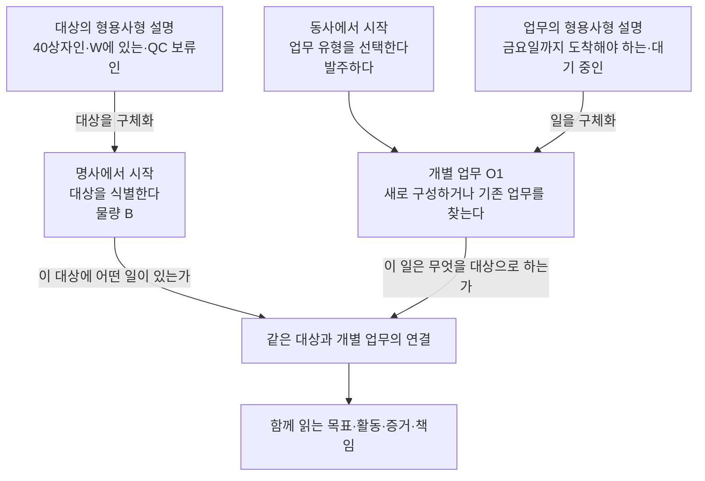
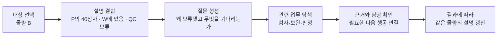
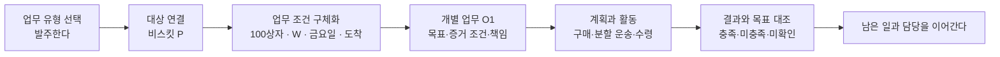
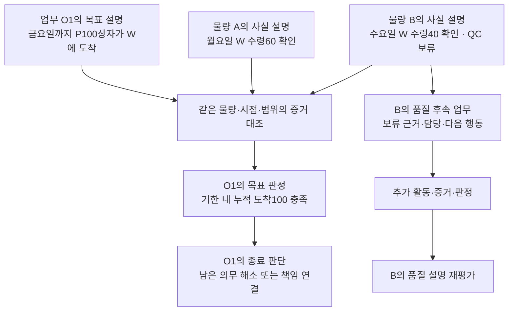
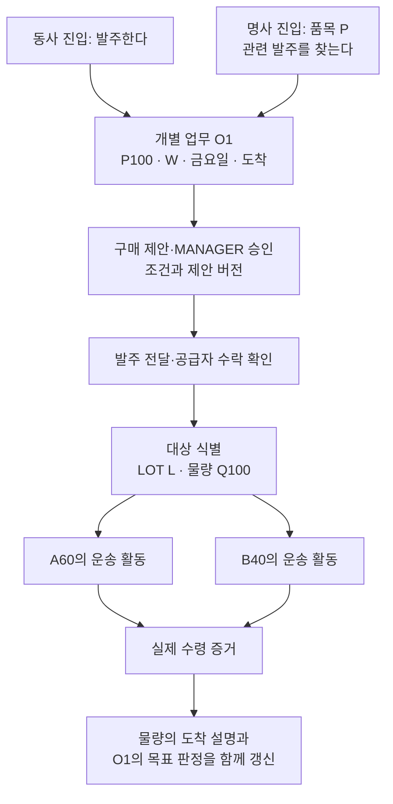
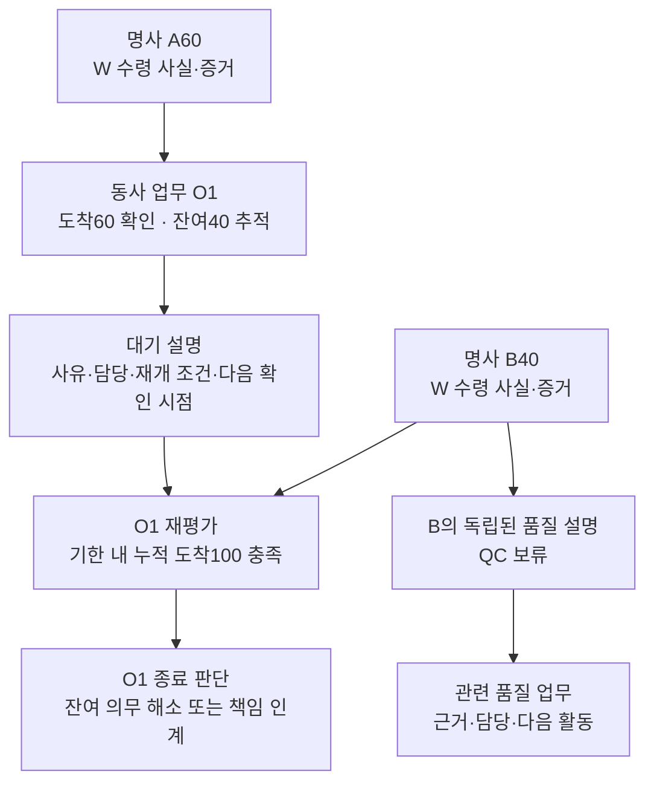
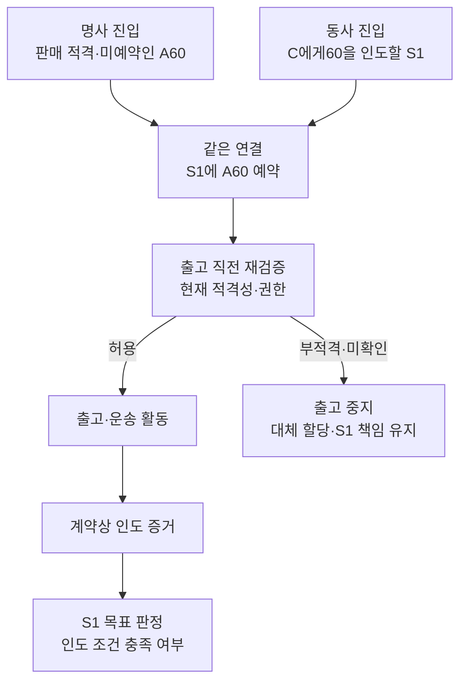
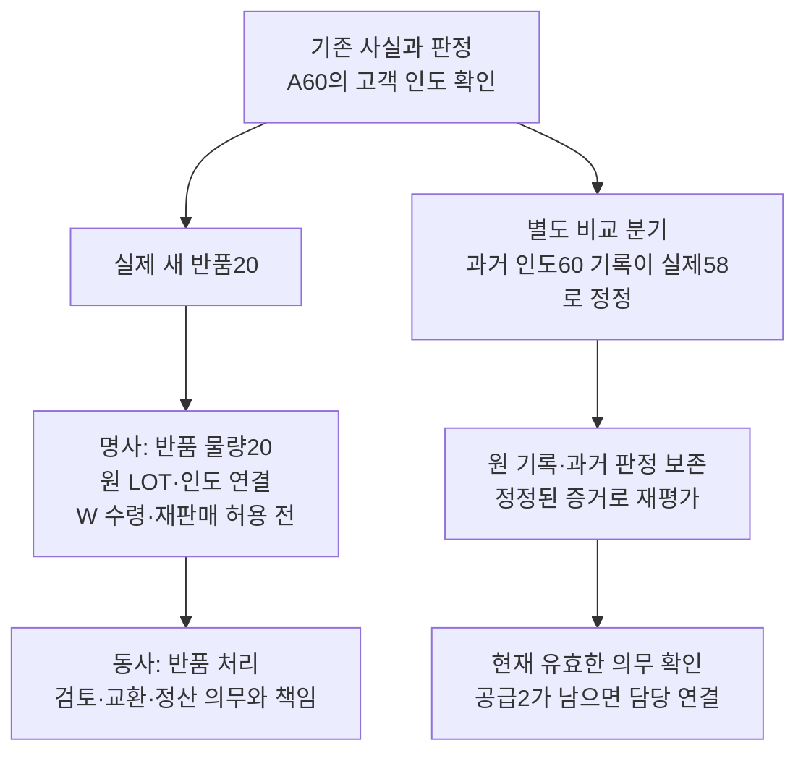
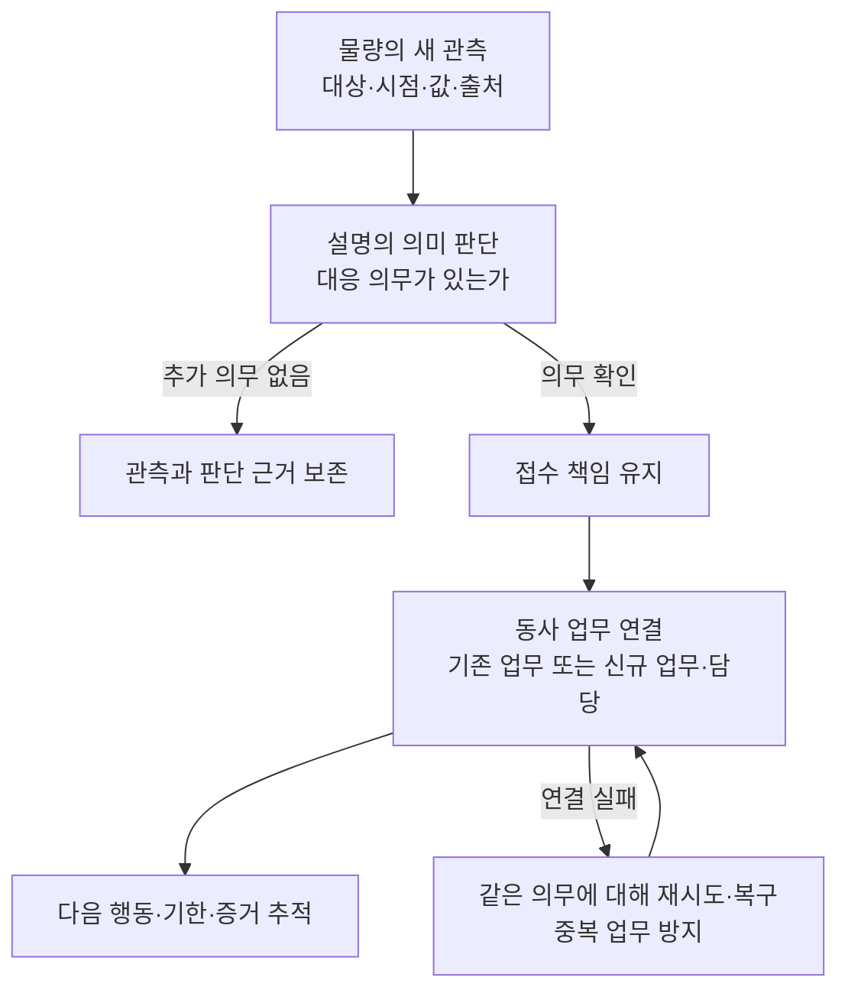
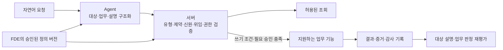

# 통사구조로 업무를 설계한다 — 철학과 워크플로우 통합 설명서

작성일: 2026-10-07

이 문서는 설계 철학, 예시 워크플로우, 팀 설명의 기준 문서다. 1–6장은 철학, [7–12장](#workflows)은 업무 사례, [13장](#implementation)은 해석과 검증의 의미, 14장은 업무 범위, [15장](#scope)은 채택 범위를 설명한다. 기술 스택·구현·전환·실행 검증은 [별도 구현 계획](ontology-implementation-plan.md)에서 관리한다.

**명사는 관리할 대상을 열고, 동사는 관리할 일을 연다. 형용사는 그 대상과 일이 어떠한지를 더해 구체적인 업무를 만든다.**

이 설계에서 품사는 업무를 이해하고 구성하는 사고의 틀이다. “무엇인가”, “무엇을 하는가”, “어떠한가”라는 질문으로 개념을 찾고, 그 개념을 연결해 사실과 의도, 진행 상황을 표현한다. 통사구조는 이 요소들이 어떤 자리와 관계로 결합하는지를 정한다.

여기서 형용사는 자연어의 엄밀한 품사 분류보다 넓은 뜻이다. 대상과 업무에 붙는 속성·상태·조건을 가리킨다. “60상자인 물량”, “QC 보류인 물량”, “금요일까지 도착해야 하는 발주”, “대기 중인 발주”가 모두 이 관점의 설명이다.

## 1. 명사와 동사를 동등한 관리의 출발점으로 둔다

사람은 때로 물건을 먼저 떠올린다. “이 비스킷은 얼마나 있으며, 어떤 상태이고, 지금 어떤 일이 진행 중인가?”라고 묻는다. 다른 때에는 일을 먼저 떠올린다. “발주하려면 무엇이 필요하며, 지금 진행 중인 발주는 무엇을 기다리는가?”라고 묻는다.

두 질문 모두 자연스러운 관리의 시작점이다. 따라서 시스템도 **대상에서 일을 찾아가는 경로와 일에서 대상을 찾아가는 경로**를 함께 제공한다.

여기서 명사와 동사는 서로 배타적인 저장 분류가 아니다. “발주하다”는 업무 유형이지만, “이번 비스킷 100상자 발주 O1”은 식별하고 다시 찾아볼 수 있는 개별 업무다. 그 업무 자체에도 상태와 조건을 붙일 수 있다.

같은 O1을 품목에서 찾아가든 발주 목록에서 찾아가든 목표·물량·증거· 담당자는 같아야 한다. 두 진입점은 하나의 업무 세계를 서로 다른 방향에서 읽는 방법이다.

## 2. 명사에서 시작하면 대상의 설명이 다음 일을 드러낸다

명사 중심의 관리에서는 먼저 대상을 식별한다. 비스킷이라는 품목을 선택하고, 그 품목의 어느 LOT와 어느 물량을 다루는지 좁힌다. 여기에 형용사형 설명을 붙이면 관리할 상황이 드러난다.

> 물량 B → 비스킷 P의 물량 B → 40상자인 B → 창고 W에 있는 B → QC 보류인 B

“비스킷”만으로는 무엇을 해야 할지 정해지지 않는다. 그러나 “W에 있는 QC 보류 물량 B40”은 현재 위치와 제한을 드러낸다. 관리자는 보류의 근거와 관련 검사 업무를 찾아 다음 행동을 판단할 수 있다.

형용사형 설명은 대상을 검색하는 조건이면서 다음 관리 질문의 출발점이다. “보류인 물량을 찾는다”에서 “그 보류를 해소하려면 어떤 일이 필요한가”로 자연스럽게 이어진다. 다만 보류라는 속성이 있다는 이유만으로 검사나 해제 작업을 매번 새로 만들지는 않는다. 이미 연결된 업무와 현재 의무를 확인하고 필요한 행동을 선택한다.

또한 속성을 붙이는 범위가 중요하다. 같은 품목의 B40이 보류됐다는 사실을 그 품목 전체나 다른 A60의 보류로 확대하지 않는다.

## 3. 동사에서 시작하면 원하는 일을 구체적인 목표로 만든다

동사 중심의 관리에서는 먼저 하려는 일이나 살펴볼 일을 선택한다. “발주하다”라는 유형을 고르고 대상과 조건을 채워 이번 업무를 만든다.

> 발주한다 → 비스킷 P를 발주한다 → 100상자를 발주한다 → 창고 W에 도착하도록 발주한다 → 금요일까지 도착해야 하는 발주 O1

각 설명은 업무의 의미를 좁힌다. 대상·수량·목적지·기한·끝점을 연결하면 무엇을 달성해야 하는지 판단할 수 있는 개별 목표가 된다. 이 프로젝트에서 발주는 필요한 물품의 목표 지점 도착까지 책임지는 업무로 해석한다.

이미 진행 중인 업무도 동사에서 찾을 수 있다. “대기 중인 발주”를 고르고 O1을 열면 대상 물량, 대기 사유, 남은 목표와 다음 확인 담당을 함께 본다. 동사 중심 관리는 새 명령의 실행뿐 아니라 진행 중인 일의 조회·조정·책임 추적을 포함한다.

업무부터 시작해도 대상은 필요하다. 다만 모든 정보를 처음부터 알아야 하는 것은 아니다. 품목과 수량은 정했지만 실제 LOT는 선적 이후에 알 수 있다. 정보별로 필요한 시점을 정해 의미를 구체화한다.

## 4. 형용사를 더한다는 것은 설명을 정밀하게 만든다는 뜻이다

명사와 동사는 관리의 뼈대를 만든다. 형용사형 설명은 그 뼈대에 이번 대상과 업무의 성질·상태·조건을 더한다.

| 더하는 설명 | 명사 중심: 물량 B | 동사 중심: 발주 O1 |
|---|---|---|
| 정체성과 연결 | 품목 P·LOT L에 속한 물량 | 품목 P를 대상으로 하는 발주 |
| 수량과 범위 | 40상자인 물량 | 총100상자 도착을 목표로 하는 발주 |
| 장소와 시간 | 수요일 W에서 수령이 확인된 물량 | 금요일까지 W에 도착해야 하는 발주 |
| 현재 상태 | QC 보류인 물량 | 잔여 물량을 기다리는 발주 |
| 근거와 후속 질문 | 왜 보류인가, 누가 판정했는가 | 무엇이 남았고, 누가 언제 확인하는가 |

이 표는 읽는 관점을 보여준다. 모든 설명을 단순 문자열 속성으로 저장한다는 뜻은 아니다. “LOT에 속한다”는 관계이고, “40상자”는 단위가 있는 값이며, “QC 보류”는 적용 범위와 판단 근거가 필요한 상태다. “목표가 충족됐다”는 목표와 증거를 대조한 판정이다.

그래서 속성을 더할 때는 세 가지를 함께 정한다.

- **어디에 붙는가:** 품목 전체인지 특정 물량인지, 업무 유형인지 개별 업무인지 정한다.
- **언제 무엇을 설명하는가:** 현재 사실, 과거 관측, 앞으로 달성할 조건을 구별한다.
- **무엇을 근거로 하는가:** 값의 출처와 필요한 단위·시점·판정 근거를 연결한다.

형용사를 덧붙이는 것은 기존 값을 계속 덮어쓰는 일이 아니다. “운송 중이던 B가 W에 도착했다”면 과거 운송과 현재 수령을 연결한다. “도착한 B가 QC 보류다”라면 위치와 품질이라는 두 설명이 함께 성립한다. 속성이 비어 있으면 확인되지 않은 것이지 자동으로 정상인 것은 아니다.

특히 **현재의 설명과 목표의 설명을 구별한다.** “W에 도착해야 하는 물량”은 의도이고 “W에 도착한 물량”은 증거가 필요한 사실이다. 목표 문장을 현재 상태처럼 저장하는 순간 계획과 현실이 섞인다.

## 5. 워크플로우는 대상과 일의 설명을 연결하며 전개된다

통사구조로 구성한 업무는 활동 결과를 받아 다시 평가된다. 물량의 설명이 달라지면 관련 업무의 목표 판정에 영향을 줄 수 있고, 업무의 결과는 해당 물량의 새 상태를 설명하는 근거가 될 수 있다. 이 연결이 워크플로우를 이어 간다.

위 예시는 금요일까지 누적 도착100을 목표로 삼고, 두 수령이 유효한 도착 증거로 확인됐다는 가정이다. 월요일에는60이 확인돼 잔여40의 책임이 남는다. 수요일에는 나머지40의 도착도 확인돼 도착 목표가 충족된다. 그러나 B40의 QC 보류는 그대로이며 품질 후속 책임도 남는다.

이를 명사에서 읽으면 “A와 B는 어디에 있고 어떤 상태인가”가 된다. 동사에서 읽으면 “O1은 무엇을 달성했고 어떤 후속 업무가 남았는가”가 된다. 두 경로가 같은 사실과 관계를 사용하므로 설명도 일치해야 한다.

“완료된 검사”와 “적합한 물량”, “종료된 업무”와 “달성된 목표”는 각각 별개의 설명이다. 상태 단어가 서로 비슷하다는 이유로 전파하지 않고 결과·증거·판정으로 연결한다. Agent의 한 번의 실행이 끝나도 남은 업무와 책임은 계속 식별할 수 있어야 한다.

## 6. 공통 문법은 표현을 확장하면서 의미를 유지하게 한다

이 방식의 유연성은 승인된 개념과 속성을 조합해 여러 상황을 표현하는 데 있다. “W의 보류 물량”, “금요일까지 도착해야 하는 발주”, “증거를 기다리는 검사”를 같은 사고방식으로 구성하고 탐색할 수 있다.

그 조합에는 규칙이 있다. 물량의 위치 자리에는 장소가 연결되고, 수량에는 단위가 붙으며, 목표에는 달성 조건과 증거가 연결된다. 관계의 방향·연결 개수·필수 조건·적용 범위가 표현의 의미를 지킨다.

FDE는 구축 과정에서 이 어휘와 결합 규칙을 정의하고 버전으로 관리한다. 운영 Agent는 승인된 정의를 사용해 자연어 요청을 해석하고 지원하는 업무 기능에 연결한다. 구조가 맞는 표현인지, 사실로 확인됐는지, 실행할 권한이 있는지는 각각 검증한다.

품사와 테이블의 일대일 대응이나 별도 DSL·parser 도입을 여기서 확정하지 않는다. 다음 장부터는 이 공통 원리가 구매·수령·판매·반품의 각 단계에서 어떻게 관리 질문과 후속 업무를 만드는지 따라간다.

## 7. 같은 철학으로 한 업무의 시작부터 후속까지 읽는다

이후 사례는 이탈리아 완제품을 수입해 국내 B2B 거래처에 인도하는 범위다. 국내 제조·BOM, 소비자 직접 판매, 총계정원장은 초기 범위에서 제외한다. 기존 제조 기능과 추적 기록은 보존한다.

각 사례를 **관리의 출발점 → 대상과 일에 더하는 설명 → 실제 활동과 증거 → 양쪽 설명의 재평가 → 남은 책임** 순서로 읽는다. 절차의 이름을 외우기보다 어떤 사실과 목표가 연결되는지를 본다.

| 공통 예시의 개념 | 식별과 설명 |
|---|---|
| 품목 P | 거래 규격과 상자 단위가 확인된 비스킷 |
| 제조 LOT L | 제조자·품목 문맥에서 식별한 배치 |
| 물량 Q, A, B | Q100을 실물 분할한 A60과 B40. 같은 품목·LOT이며 서로 구별 가능 |
| 장소 W | 실제 수령 장소인 국내 창고 |
| 발주 업무 O1 | 특정 주 금요일 마감까지 W에 누적100상자 도착을 목표로 하는 업무 |
| 판매 업무 S1 | 고객 C에게60상자를 계약상 인도하는 업무 |
| 증거·책임 | 식별·대조된 수령 기록을 O1의 도착 증거로 인정하고 실제 담당자를 지정 |

금요일은 실제 업무에서 날짜·시간대까지 확정한다. 두 분할 물량은 모두 기한 내 도착하며, A60은 판매 관련 조건을 충족하고 B40은 QC 보류라고 가정한다. 다른 입출고·감소·예약은 없으며 별도 비교 사례는 본문에 표시한다. 예시 값과 증거 정책이 새 기본 정책을 뜻하지는 않는다.

명사에서 출발해도 같은 품목·LOT·물량을 구분해야 한다. 팔레트는 여러 LOT를 담을 수 있지만 그 LOT들을 하나로 바꾸지 않는다. 분할 뒤의 현재 물량은 A60+B40이다. 과거 Q100까지 더해200으로 세지 않으며 폐기·분실 등 실제 감소가 있으면 근거 있는 감소량을 대조한다.

## 8. 발주 — 동사에서 시작해 물량의 사실로 목표를 확인한다

**시작점은 “발주한다”는 동사다.** 품목 P를 연결하고 수량100·목적지W· 금요일 기한·도착 끝점을 더하면 이번 업무 O1이 된다. 품목 P에서 “진행 중인 발주”를 찾아도 같은 O1을 읽는다.

| 구체화하는 방향 | 붙이거나 연결하는 설명 |
|---|---|
| 업무 O1 | P100상자를 W에 기한 내 도착시켜야 하는 업무, 구매 조건과 증거 정책, 담당자 |
| 대상 물량 | 공급 확정·선적 뒤 식별되는 LOT L과 Q100, 분할 물량 A60·B40 |
| 수행 활동 | 승인된 제안의 전달, 공급자 수락 확인, 운송 구간과 인계 기록 |

구매 제안, 내부 승인, 발주 전달, 공급자의 약속은 다른 기록이다. 발주서 전달이 끝났다는 사실만으로 O1을 달성했다고 설명하지 않는다. 승인 후 가격·수량·대상 등이 승인 범위를 벗어나면 재검토한다. 공급자 변경도 품목 대체의 자동 허용을 뜻하지 않는다.

100을60+40으로 나누어 보내는 것은 허용 범위 안에서 계획을 바꾸는 일이다.100을80으로 줄이거나 목적지·기한·끝점을 바꾸는 것은 목표를 바꾸는 일이다. 이전 목표와 변경 결정·이유·적용 범위를 보존한다. 한 활동이 실패하면 대안을 찾을 수 있지만 추가 비용과 권한도 확인한다.

한 운송이 여러 발주를 합쳐 실을 수도 있다. 주문별 배분, 운송 건·구간, 물류 단위·물량을 연결하되 같은 물량을 독립된 수요에 중복 배정하지 않는다. 항구에 도착한 것과 W에 도착한 것은 다른 설명이다. 예정 목적지는 아직 실제 위치가 아니다.

필요한 값은 요청·유효한 문맥·승인된 기본값에서 채우고 출처를 남긴다. “평소처럼”이라는 말만으로 과거 한 건을 복사하지 않는다. LOT처럼 나중에 알 수 있는 정보는 필요한 단계에서 연결하며 결과를 바꾸는 모호함은 확인한다. 목표 해석의 확정과 구매 실행의 승인은 별개다.

## 9. 수령과 QC — 명사의 새 설명이 업무의 판정을 바꾼다

월요일 A60의 W 수령이 확인됐다. **이번 시작점은 도착한 물량이라는 명사다.** 실제 장소·수량·시각·근거를 붙이고 관련 업무 O1을 찾아 그 사실이 목표에 얼마나 기여하는지 판단한다.

| 시점 | 대상에 더해진 사실 설명 | 업무에 더해진 진행·판정 설명 |
|---|---|---|
| 월요일 | A60은 W에서 수령이 확인됨. B40은 운송 중임이 확인됨 | O1의 도착60 확인, 잔여40 추적과 담당 유지 |
| 수요일 | B40도 W에서 수령이 확인됨. B40에는 QC 보류가 있음 | O1의 누적 도착100 충족. B의 품질 후속 책임은 유지 |

같은 A60에 대해 운송사와 창고의 보고가 있으면 증거는 두 개여도 물량은60이다. 대상·수량·장소·시점·범위·출처를 대조하고 중복을 제외한다. 증거가 없기만 한 경우에는 실제 미도착을 단정하지 않고 미확인으로 남긴다. 다른 창고에 도착한 물량도 W 도착을 충족하지 않는다.

도착과 품질은 다른 설명이므로 QC 보류가 도착 사실을 지우지 않는다. 반대로 도착 목표의 충족이 판매 허용을 만들지도 않는다. 수입 신고· 기관 결과·표시 확인과 내부 QC는 물량에 연결되는 별도의 근거다. 부분 처리·보완·반려·재제출도 해당 범위에 붙인다. 이 연결은 법정 처리 순서를 정한 것이 아니며 기관 자동 제출은 별도 연동 범위다.

**비교 분기:** A60을 먼저 출고한 뒤 B40이 도착하면 누적 도착은100, 현재 W 보유는40이다. B40이 기한 뒤 도착하면 수량 충족과 납기 미충족을 함께 남긴다. 업무의 시간 조건에 따라 같은 사건들의 판정이 달라진다.

대기는 다음 확인 주체·시점·초과 시 대응을 가진 상태다. 시간이 흘렀다는 이유로 승인이나 완료가 되지 않는다. 취소로 종료해도 목표 달성으로 표시하지 않는다. 출하 물품·비용·품질 대응처럼 남은 의무는 해소하거나 후속 업무에 책임을 연결한다. 인계 요청만으로 기존 책임을 해제하지 않으며 활동 위임도 주 책임의 자동 이전이 아니다.

## 10. 판매 — 명사의 적격 조건과 동사의 인도 목표를 연결한다

고객 C의60상자 주문을 이행한다. “W의 판매 가능한 물량”에서 출발하면 조건에 맞는 명사를 찾는다. “고객 C에게 인도한다”에서 출발하면 판매 업무 S1의 대상을 찾는다. 두 경로는 같은 예약과 물량으로 만난다.

| 명사 쪽에서 확인하는 설명 | 동사 쪽에서 구체화하는 설명 |
|---|---|
| A60은 W에 있고 판매·인도 관련 조건을 충족하며 미예약임 | S1은 C에게60상자를 계약상 끝점까지 인도해야 함 |
| B40은 W에 있으나 QC 보류임 | S1의 할당 후보에서 B를 제외하고 A60을 연결함 |
| A60은 S1에 예약됨. 출고 직전 조건을 다시 확인함 | 피킹·출고·운송과 인도 증거를 추적함 |

예시에서 수령 뒤 W 보유는100이지만 판매 적격은 A60이다. A60을 예약하면 보유100·적격60·예약60·미예약 적격0이 된다. 다른 주문이 같은60을 또 예약할 수 없어야 한다. 출고하면 W 보유는 B40만 남는다. 예약은 실물 출고가 아니고, 출고는 고객 인도가 아니다.

후보는 FEFO를 기본으로 고객 조건·실제 적격성을 함께 확인한다. 예약 뒤 QC 보류·회수·기한 경과·처분 허용 취소가 생기면 출고를 막는다. 여러 제한 중 하나가 해제됐다고 모두 허용하지 않는다. 식별·수량이 불확실한 수령도 임시 접수할 수 있지만 대조 전 정규 가용 재고로 인정하지 않는다. 부분 배송·수령 거부·반송도 원 주문에 연결한다.

### “판매 가능한”이라는 설명은 여러 근거의 결합이다

위치·보관 주체·소유자·위험 부담·물량별 처분 허용은 각각 구별한다. 판매 가능은 창고 위치나 직원의 앱 권한만으로 결정하지 않는다.

**별도 비교 사례:** 공급자 소유 위탁판매품40과 고객 소유 보관품60이 있다. 위탁판매40의 판매 근거와 나머지 조건이 확인됐고 고객 보관60에는 판매 허용이 없다면 보유100·판매 적격40이다. QC 해제나 직원 권한 변경으로 고객 보관60이 판매 가능해지지 않는다. 허용 근거가 미확인이면 보유 사실은 남기되 확인된 공급 가능량에 포함하지 않는다. 판매 불가인 물량도 반송 등 다른 행동은 그 행동의 근거로 판단한다.

이 사례에서 형용사 “판매 가능한”은 자유롭게 붙이는 태그가 아니라 여러 사실·제약·허용 근거를 특정 시점에 대조한 설명이다.

## 11. 반품·정정·회수 — 무엇이 새 사실이고 무엇이 바뀐 해석인가

S1의 고객 인도60이 확인된 뒤 실제20상자가 반품됐다고 하자. 명사에서 시작하면 “A에서 돌아온20상자”를 식별하고 원 LOT·인도, 현재 위치·검토 상태를 연결한다. 동사에서 시작하면 “반품을 처리한다”는 업무에 그 물량과 교환·정산 등의 현재 의무를 연결한다.

반품 분기는 인도60과 이후 반품20을 각각 보존한다. 반품 수령·대조가 끝나면 W에는 B40과 반품20이 있지만 반품품을 자동 재판매하지 않는다. 원 A60과 반품20을 별개 현재 재고로 중복 합산하지 않는다.

정정 분기에는 실제 새 반품이 없다. 발생 시각과 기록 시각, 과거에 알고 있던 사실과 정정된 해석을 구별한다. 현재 공급 의무2가 이미 다른 방식으로 해소됐다면 정정만으로 의무를 부활시키지 않는다. 실사 차이·폐기도 이력과 근거를 남기며 현재 수량을 조용히 덮어쓰지 않는다.

### 회수와 정산도 대상·조건·끝점을 가진 업무다

LOT 이상이 발견되면 관계를 따라 물량·출고처를 찾고 영향 후보와 확인된 사실을 구별한다. 필요 시 ADMIN 회수 결정과 통지·회수·처분· 미확인량 추적을 연결한다. 일반 반품과 회수는 별도 업무 유형이다. 추적 관계가 있다고 오염이 확정되는 것은 아니다.

**별도 비교 사례:** X40과 Y60을 섞어 실물 구분이 불가능한100이 됐다면, X의 문제가 발견될 때 원천 영향량40과 현재 영향 후보100을 구별한다. 계보 수량만으로 일부가 안전하다고 단정하지 않는다. 회수25를 폐기해도 회수량이50이 되지 않는다. 회수·처분·소비·손실·미확인량을 구별한다.

정산은 물류 목표와 연결된 별도 목표다. 상품이 도착해도 송장 차이나 운송비 조정은 남을 수 있다. 발주·수령·송장·금액과 계약을 대조하고 통화·환율 적용일·원 금액·환산값을 구별한다. 초기 범위는 문서·금액· 지급·수금 참조이며 총계정원장·세금 신고·실제 은행 이체는 포함하지 않는다.

### 같은 사례를 두 관점으로 읽었을 때 수량도 일치해야 한다

아래는 실제 반품 분기다. A60은 판매 조건 확인을 마쳤고, B40은 QC 보류, 반품20은 재판매 허용 전이며 다른 입출고는 없다고 가정한다.

| 확인된 시점 | O1 누적 조달 도착 | W 보유 | 판매 적격 | 예약 | 미예약 적격 |
|---|---:|---:|---:|---:|---:|
| A60 수령·판매 조건 확인 | 60 | 60 | 60 | 0 | 60 |
| B40 수령·QC 보류 | 100 | 100 | 60 | 0 | 60 |
| S1에 A60 예약 | 100 | 100 | 60 | 60 | 0 |
| A60 출고·예약 소진 | 100 | 40 | 0 | 0 | 0 |
| A60 고객 인도 확인 | 100 | 40 | 0 | 0 | 0 |
| 반품20의 W 재입고·대조 완료 | 100 | 60 | 0 | 0 | 0 |

“얼마나 도착했나”에도 업무·물량·기간의 범위가 필요하다. 반품20은 새 수령이지만 O1의 조달 이행량에 더해120으로 만들지 않는다. 명사와 동사의 두 조회는 이 범위를 공유한다.

## 12. 운영 관측 — 새로운 설명에서 대응할 일을 찾는다

O1이 종료된 뒤 B40에 새 온도 이상이 관측됐다고 하자. **명사의 새 관측 설명에서 시작해 필요한 동사 업무를 찾는 경로**다. B의 기존 QC 후속 업무가 이 의무를 맡는지 확인하고, 맡을 업무가 없으면 접수 책임을 유지하며 담당 업무를 배정한다.

**별도 비교 사례:** 조달과 QC 후속까지 모두 끝난 보관 물량에도 새 이상이 생길 수 있다. 관련 활성 업무가 없어도 같은 접수·배정 경로를 적용한다. 정상 관측마다 업무·Run을 만들지는 않지만 대응 의무가 확인되면 연결 전 책임을 유지한다. 신규 업무는 담당자를 바로 배정할 수 있으며 모든 초기 배정에 인수 대기를 요구하지 않는다. 알림 전송만으로 해결 처리하지 않는다.

외부 기록은 원천 ID·버전·발생 시각·수신 시각으로 대조한다. 같은 수령의 재전송은 효과를 한 번만 반영하고 별개 수령은 별개로 남긴다. 공급자의 출하100과 창고의 수령98은 서로 다른 관측이다. 최신 값 하나로 덮지 않으며 상충·지연·순서 역전·정정의 적용 범위를 판단한다. 외부 쓰기가 성공했는지 불명확하면 먼저 확인하고 재시도한다.

## 13. 공통 언어를 해석·실행·검증에 연결한다

### 같은 개념으로 사실·조회·목표를 표현한다

| 표현 | 구성 | 확인할 차이 |
|---|---|---|
| “A60이 월요일 W에 도착했다” | 대상·활동·시점·증거 | 형태가 맞아도 증거가 없으면 사실 미확인 |
| “지금 W의 QC 보류 물량은?” | 대상 유형·관계·상태·조회 시점 | 조회가 보류 해제로 바뀌지 않아야 함 |
| “P100을 금요일까지 W에 도착시켜라” | 업무·대상·수량·지점·기한·끝점 | 단위·끝점·책임 등 필요한 조건을 구체화 |
| `위치한다(A, 금요일)` | 물량·위치 관계 | 장소 자리에 날짜가 온 유형 오류 |

동사에는 대상 사이의 관계, 시점과 결과가 있는 활동, 목표를 가진 업무가 있다. 관계를 등록할 때마다 목표 업무를 만들지 않는다. 새 어휘가 실행 코드·임의 SQL·새 권한을 자동 생성하지도 않는다.

미지원 의미를 비슷한 명령으로 억지로 실행하지 않는다. 모호함은 확인하고 불충족 조건은 보류·거부 사유로 남긴다. 외부 문서의 지시는 권한이 아니다. 일반 역할에 쓰기 권한이 있어도 현재 Agent 위임이 조회 전용이면 서버가 쓰기를 거부한다. 요청자·실행자·주 책임자를 문장의 주어나 역할 이름만으로 동일시하지 않는다.

서버 검증 통과가 원문 의도를 정확히 이해했다는 증명은 아니다. 진행 중 업무는 사용한 정의 버전에 연결하고 전환은 명시적으로 한다. 현재 행동의 필수 규제·권한·안전 정책은 효력에 맞춰 재검증한다. 과거 의미의 보존이 현재 제한을 우회하는 근거가 되지 않는다.

### 두 관점이 같은 결과를 설명해야 한다

명사에서 읽은 물량·증거·책임과 동사에서 읽은 업무·판정은 같은 사실을 가리켜야 한다. 중복 증거가 수량을 늘리지 않으며, 누적 도착과 현재 보유·판매 적격량을 구별한다. 반품과 과거 사실의 정정도 별개다. 과거 판정이 유지돼도 현재 유효한 의무에는 책임자가 있어야 한다.

## 14. 업무 범위와 구현 선택을 구별한다

이번 초기 업무 범위는 이탈리아 완제품 수입에서 국내 B2B 인도까지다. 원자재·국내 제조 중심의 최초 기획과 공유하는 목적은 현지화·LOT 추적·인간 승인·감사다. 팀 전체의 범위 변경 합의를 전제하지 않는다.

사용자는 fork에서 새 설계를 구현할 계획을 선택했다. 구체 기술·기존 코드 대응·전환·실행 검증은 [별도 구현 계획](ontology-implementation-plan.md)에서 관리한다. 이 설명서는 기술 스택에 종속되지 않는 업무 의미를 설명한다.

## 15. 채택 범위와 원 논의의 대응

설계의 기본 방향과 C1–C5 보완은 채택됐다. 현재 결정은 [논의 기록](ontology-discussion.md)의 §10·§12를 따른다. 다음 세부 보완안은 별도 제안 범위다.

| 보완 제안 | 유지하는 경계 |
|---|---|
| D02 포장 처리 | 내용량 환산과 주문 대체 가능성을 구별한다. 같은 내용량이어도 자동으로 같은 주문을 이행하지 않으며 환산만으로 개봉·재포장·재고가 생기지 않는다 |
| D05·D07 계약 관리 구조 | 계약 원본·버전·조항·적용 범위의 구체 구조는 보완 제안이다. Agent의 조항 해석은 확인 전 실행 권한이 아니다 |
| D14·D04 관측·계산 방식 | 절대 관측값 보존과 차이 계산의 구체 방식은 보완 제안이다. 같은 범위인지 확인하고 미관측을0, 차이를 즉시 분실로 처리하지 않는다 |

품목별 기준 단위와 검증된 환산을 사용하고 불가분 단위에 소수를 허용하지 않는다. 허용 오차가 있어도 원 차이와 승인 근거를 남긴다. 파손에 따른 가용성 감소와 실제 물량 감소도 구별한다.

| 통합 설명 위치 | 원 설계 항목 | 보존한 의미 |
|---|---|---|
| 1–6·13장 | §1–§4, D07·D09·D20·D21 | 두 진입점·결합 규칙·설명 구체화·목표·FDE와 Agent |
| 7·8·9장 | D01·D13·D14·D15 | 초기 범위·구매·운송·수입 근거 |
| 4·7·9·11·15장 | D02·D03·D04·D06·D12 | 식별·수량·사건·상태·증거·정정 |
| 3·8·9·12·13장 | D08·D10·D11 | 주체·위임·책임·대기·변경·종료 |
| 10장 | D05·D16·D17 | 처분 허용·공급 적격성·예약·고객 인도 |
| 11장 | D18·D19 | 반품·회수·정산 |
| 12–14장과 별도 구현 계획 | D22·D23·D24 | 외부 기록·전환 경계·인가·감사 |
| 12·13장과 각 사례 | D25·D26 | 결과 검증·의미 평가·운영 관측·복구 |

이 문서는 현재 설명을 읽는 통합본이다. [논의 기록](ontology-discussion.md)은 제안·사용자 코멘트·현재 결정·변경 이력을 보존하고, 두 검토 보고서는 당시의 반례·판정·기준선 기록을 보존한다. 통합은 새로운 구현 결정이나 미합의 보완안의 일괄 채택을 추가하지 않는다.

### 근거 자료

- [논의 기록](ontology-discussion.md): 원 설계 D01–D26과 §10·§12의 채택 범위.
- [Astra 논리 검토](reviews/2026-10-07-ontology-adversarial-debate.md), [Sol 논리 검토](reviews/2026-10-07-ontology-sol-xhigh-debate.md): 검토 당시 기록.
- [최초 기획안](https://github.com/mulino-coreano/mulino-coreano-erp/blob/2ea59977308d8dd26267550f4035903d46d05f75/docs/01_project_overview.txt), [기존 타임라인](https://github.com/mulino-coreano/mulino-coreano-erp/blob/2ea59977308d8dd26267550f4035903d46d05f75/docs/00_timeline.md): 현지화 목적과 제조·Agent·대시보드 계획.
- [fork 범위 결정 기록](https://github.com/se0nghe0n/mulino-coreano-erp/blob/5a1b12ac0d2821dae9d87924a3e24ff2bfa783ca/docs/16_decisions.md): 확인한 commit의 MONITOR 대화 MCP 범위 결정.
- [fork 구현 현황 기록](https://github.com/se0nghe0n/mulino-coreano-erp/blob/5a1b12ac0d2821dae9d87924a3e24ff2bfa783ca/AGENTS.md): 확인한 commit의 기능·검증 범위. 이번에 실행을 재검증한 결과는 아니다.
